# Candidatos da fase zero — 07/10/2026

Estas imagens foram produzidas pela suíte JVM da árvore inicial (commit a926566c), antes das funcionalidades Day Intelligence. Não são arte nova deste plano.

O gate inicial executou 745 testes, com 11 falhas e cinco exportadores opcionais ignorados. As falhas misturam contratos de teste antigos (nova postura/âncora de assento, 143 animações, carro sem caminhada no lugar, fala do novo brain do restaurante, fase de vibração e formato do fingerprint) e três conjuntos de baselines visuais divergentes.

As referências atuais foram preservadas. Aprovar estes candidatos como baselines **técnicas de regressão** fixa o render atual para detectar alterações futuras. Isso não altera `npc-art-v3-review-manifest.json`, cuja aprovação artística humana integral permanece PENDING.

## Cenas novas

Escola e família mantiveram os hashes. Compras e lazer diferem das referências anteriores; a folha abaixo mostra as 12 imagens usadas pelo teste. As quatro cenas de compras e as três de lazer foram inspecionadas, incluindo alinhamento de personagens, props e iluminação.

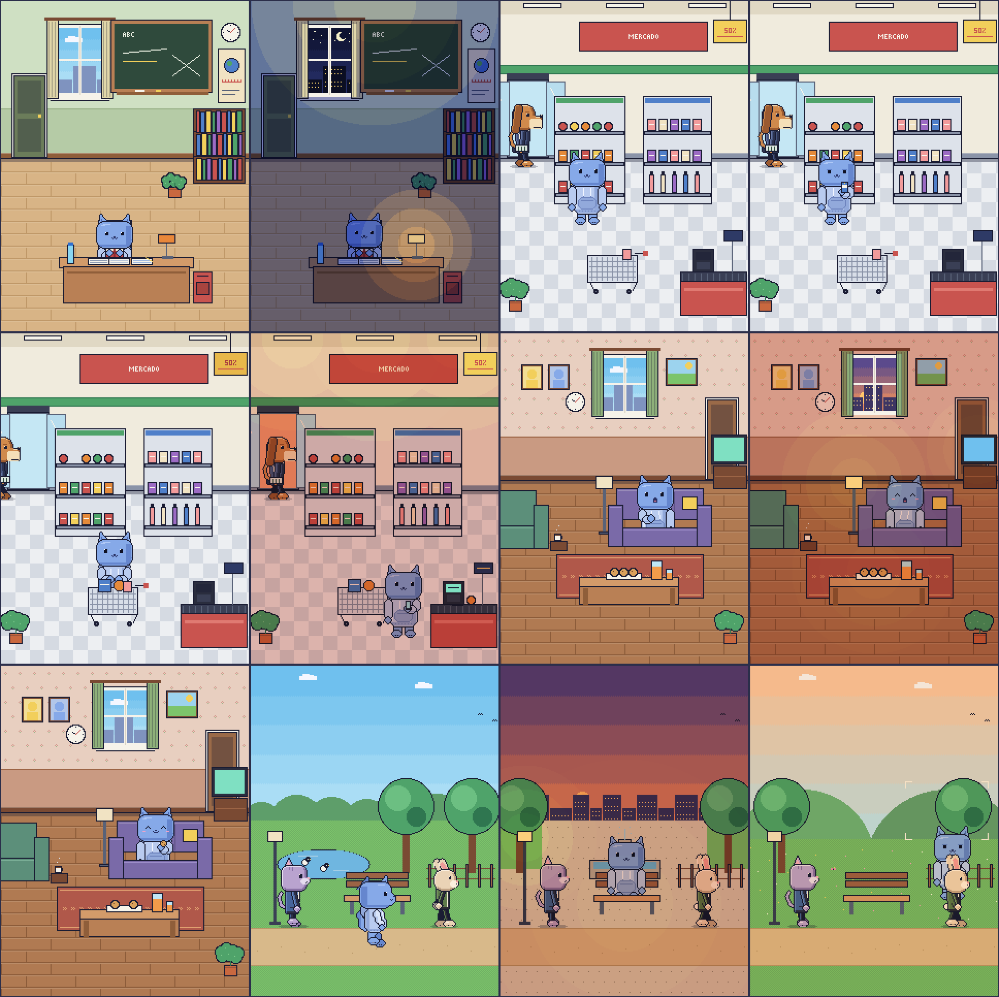

## Comparação Hoodie / NPC

Somente `hoodie_vs_dog_worker` difere do arquivo npc-art-v2.sha256. Os sete pares são preservados para comparação.

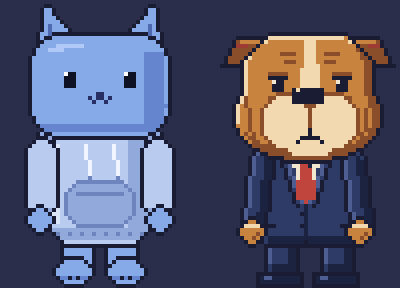
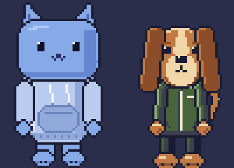
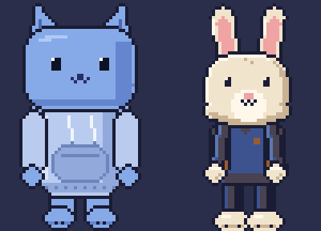
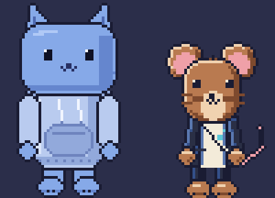
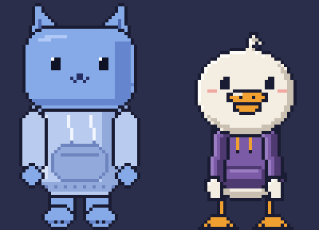
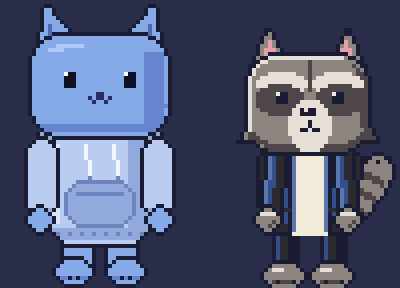
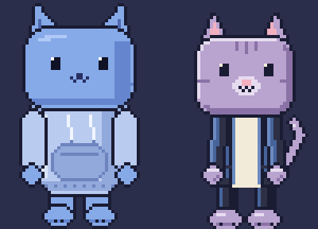

## Baselines técnicas V3

As 20 imagens individuais abaixo correspondem exatamente ao conjunto NpcArtV3GoldenTest. A matriz artística integral de animações não é promovida nem declarada aprovada por esta revisão técnica.

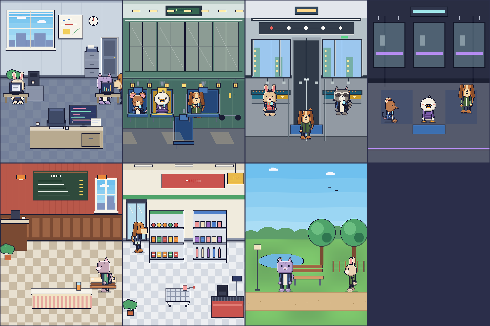

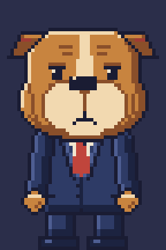
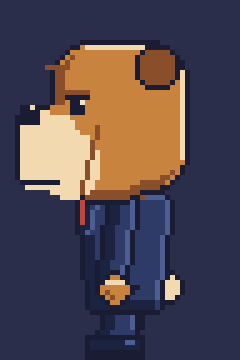
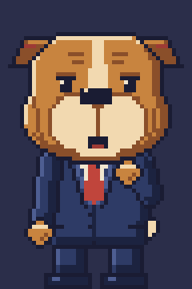
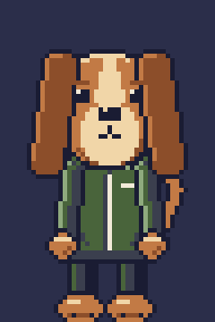
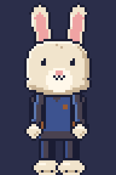
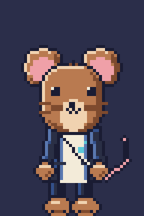

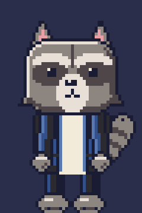
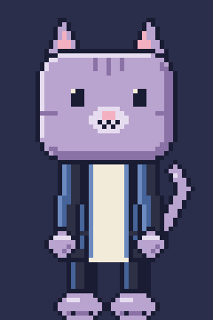

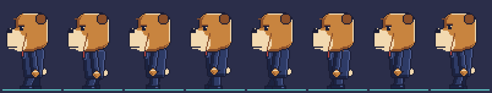
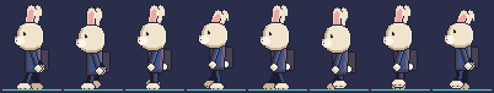
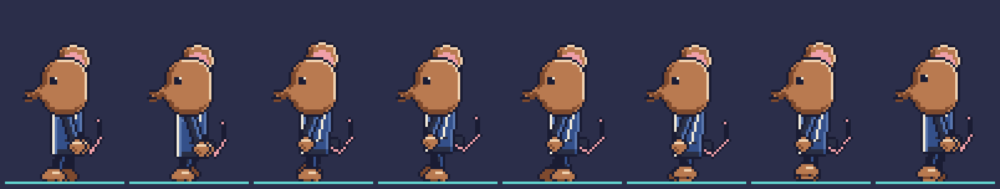
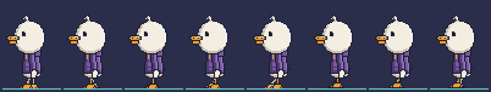

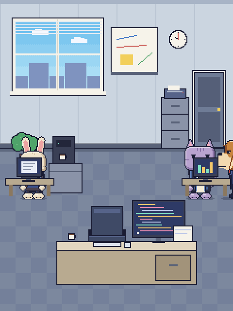
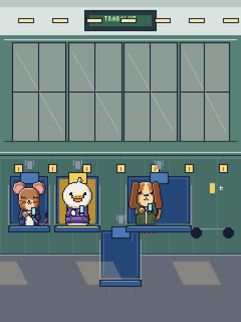
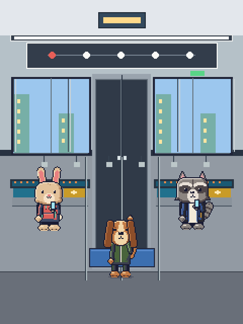
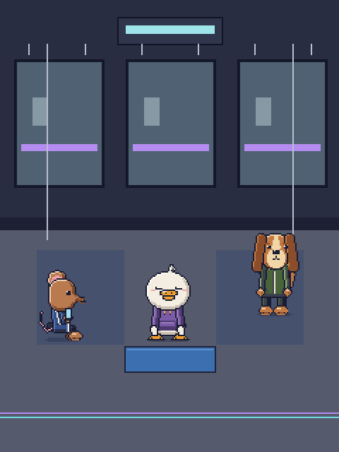
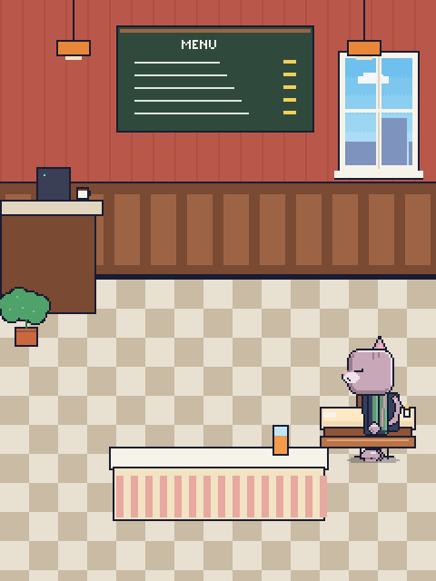
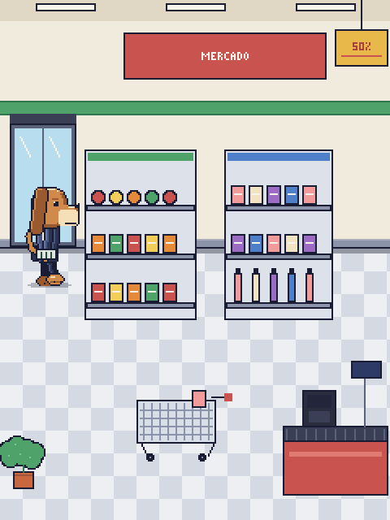
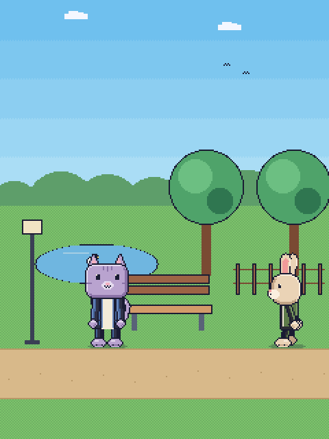

## Limite da autorização solicitada

A revisão posterior do transporte identificou um passageiro em frente ao assento central do Hoodie. O layout foi corrigido para deixá-lo visível; as capturas do trem e o candidato V3 serão substituídos após a reexecução. Até essa atualização, a imagem do trem desta galeria representa o estado anterior à correção, e não deve ser promovida como baseline.

Atualizar somente `scene-goldens-v1.sha256`, `npc-art-v2.sha256` e `npc-art-v3.sha256` com os hashes das imagens aqui apresentadas, após a geração do relatório candidato V3 pela execução focada. Não marcar a arte como APPROVED, não substituir os goldens Android API 34 e não excluir testes que falham.

## Trem após correção do assento

As capturas abaixo substituem a imagem anterior do trem para a revisão técnica pendente. O passageiro foi movido para o corredor, e os oito testes de transporte passaram. Somente os dois hashes do exportador de transporte foram atualizados; o golden V3 permanece aguardando autorização.

