# Revisão da arte NPC V3 — candidata

Esta revisão aproxima gatos, cães, buldogue e guaxinim da cabeça retangular de cantos arredondados do Hoodie. Coelho, rato e pato mantêm silhuetas próprias, com o mesmo contorno e densidade de pixels. Nas cenas, os personagens ambientais são reduzidos uniformemente para 80% e mantêm os pés alinhados; as folhas comparativas mostram os sprites em tamanho integral para facilitar a análise das proporções.

Os PNGs e hashes candidatos foram regenerados. `app/src/test/resources/npc-art-v2.sha256` agora guarda os hashes da arte V3 como teste de regressão visual; mudanças futuras de desenho devem atualizar essa referência intencionalmente.

Cada folha compara Hoodie à esquerda e NPC à direita. As linhas seguem esta ordem: Bulldog, Dog, Rabbit, Mouse, Duck, Raccoon e Cat. As três colunas mostram frente, perfil e costas. As folhas cobrem IDLE, WALK, LOOK, TALK, SIT_PHONE, SIT_EAT e SIT_SLEEP.

## Espécies e animações

### IDLE


### WALK

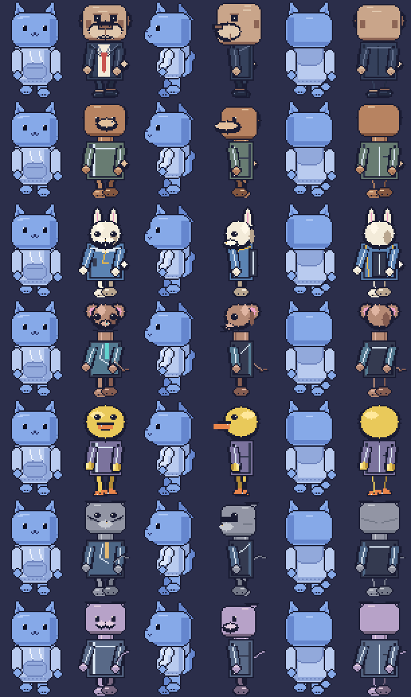

### LOOK


### TALK

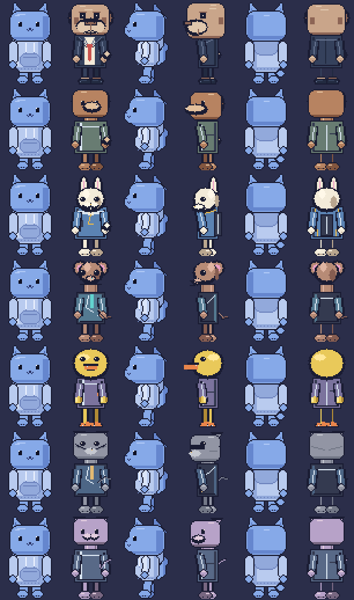

### Sentados usando o telefone

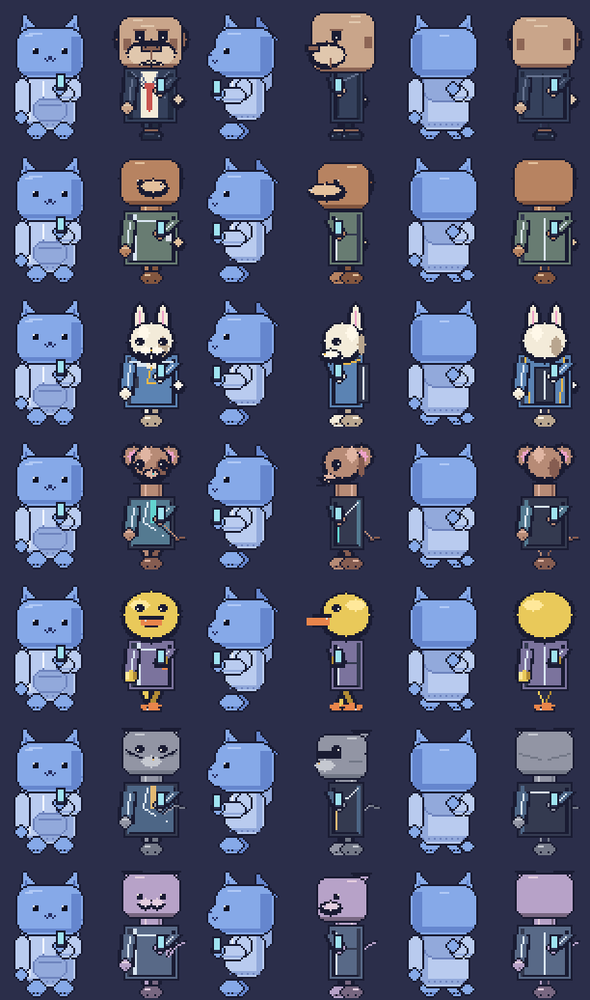

### Sentados comendo

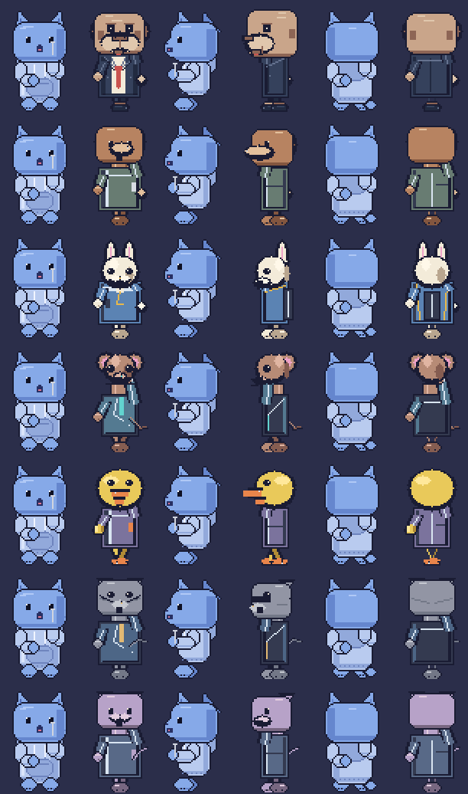

### Sentados cochilando

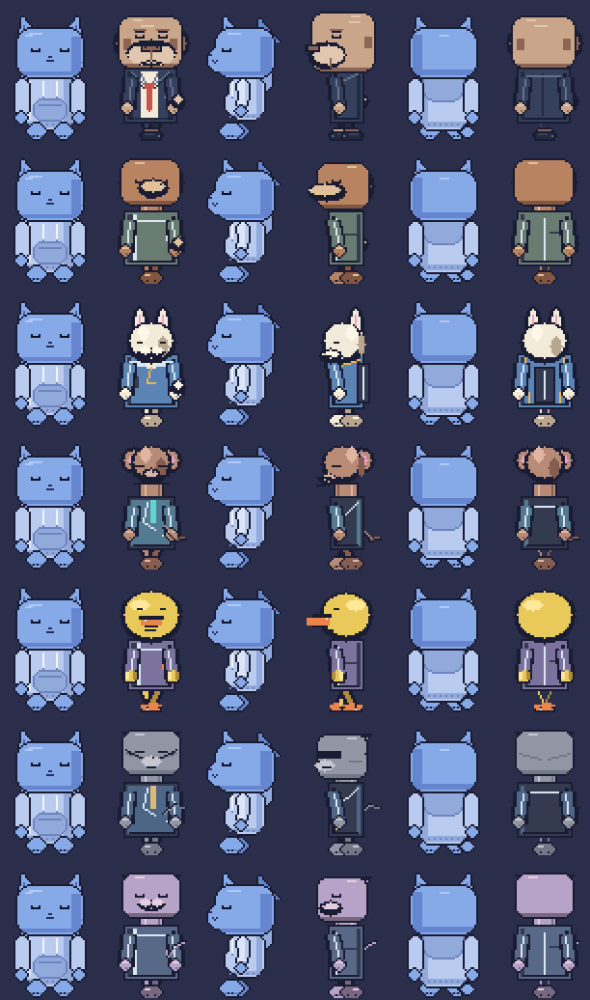

## Variações adicionais do catálogo

Estas quatro identidades reaproveitam as sete espécies-base, com traje e paleta próprios: Dog Shopper, Rabbit Reader, Rabbit Walker e Cat Guest. As folhas mostram Hoodie e cada variação em frente, perfil e costas para todo o conjunto comum de animações.

### Variações em IDLE

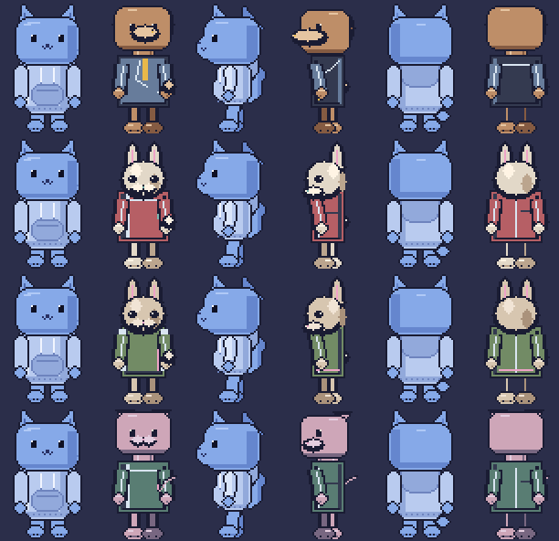

As folhas das outras animações: [WALK](npc-art-review/identities-walk.png), [LOOK](npc-art-review/identities-look.png), [TALK](npc-art-review/identities-talk.png), [SIT_PHONE](npc-art-review/identities-sit_phone.png), [SIT_EAT](npc-art-review/identities-sit_eat.png) e [SIT_SLEEP](npc-art-review/identities-sit_sleep.png). As cenas reais de compras, restaurante, trem e passeio acima também mostram esses perfis integrados.

## Bulldog — personagem de referência

### IDLE de frente

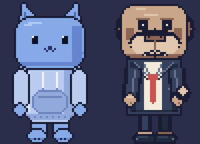

### WALK de perfil

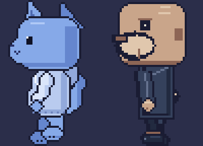

### TALK

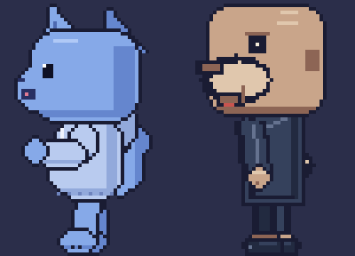

### Terno em cena diurna


### Escritório

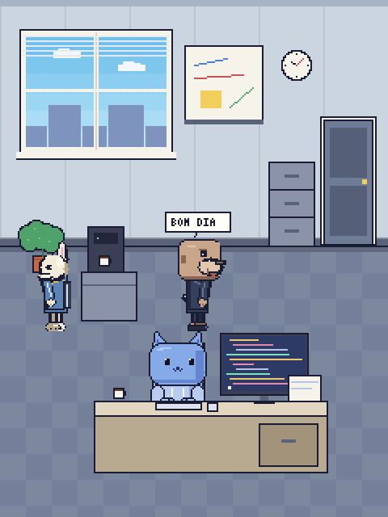

### Mouse sentado usando o telefone

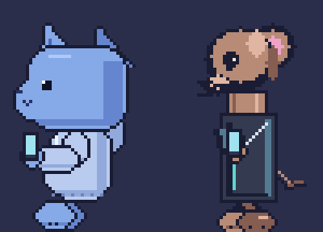

## NPCs dentro das cenas

Prévia composta pelo renderer de produção com fundo, objetos, iluminação, camadas e NPCs em escalas ambientais discretas de 95% ou 100%, aplicadas por profundidade semântica e mínimo da espécie. Inclui escritório nas duas variantes, ônibus, trem, metrô, restaurante, compras e passeio de dia; escritório, ônibus, metrô e restaurante também à noite.

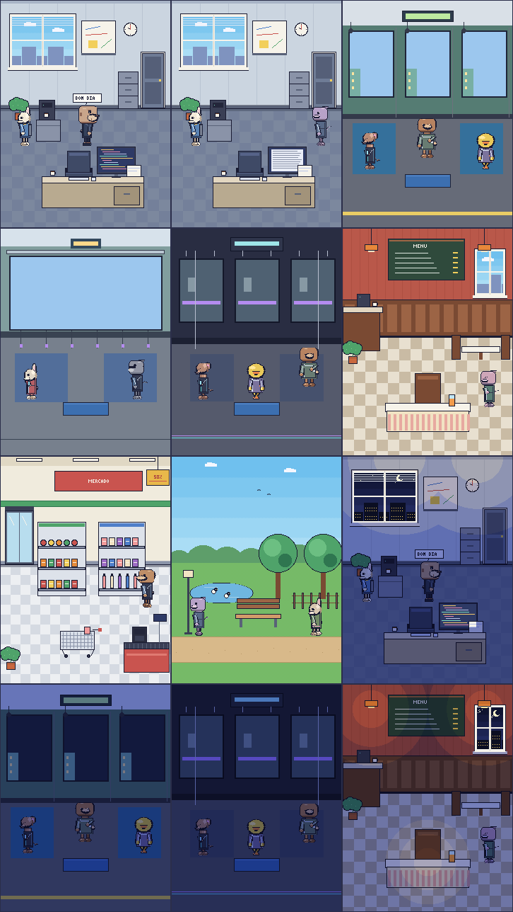

## Regressão das cenas com NPCs

As cenas públicas estão sendo revisadas novamente para a política de escala 90% / 95% / 100%. Os candidatos devem ser inspecionados quanto a clipping, sobreposição e densidade antes de qualquer atualização de golden.

Os pares Hoodie/NPC também foram revisados; as identidades ambientais mudaram de forma intencional e os digests correspondentes foram atualizados.

### Escola, compras, família e passeio

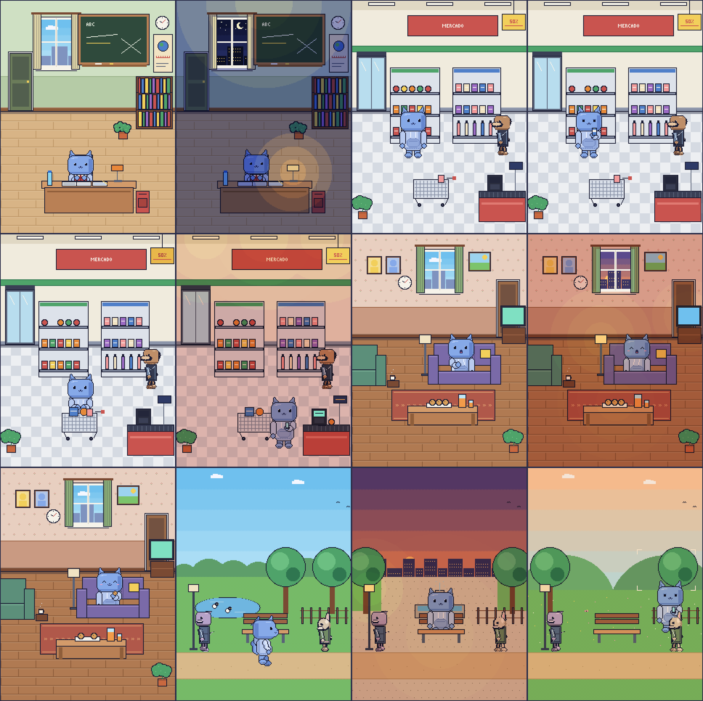

Relatório de render: [scene-goldens-v1-candidate.sha256](npc-art-review/scene-goldens-v1-candidate.sha256).

### Transporte

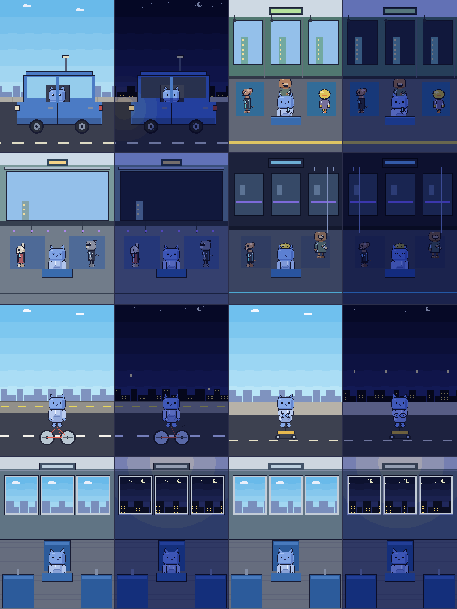

Relatório de render: [transport-scenes-v1-candidate.sha256](npc-art-review/transport-scenes-v1-candidate.sha256).

### Restaurante

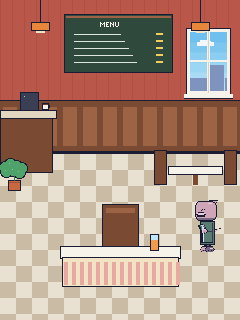

## Digests da arte NPC

`npc-art-review/npc-art-v2-candidate.sha256` registra os pixels exibidos acima. Os mesmos digests estão em `app/src/test/resources/npc-art-v2.sha256` e são verificados por `NpcArtGoldenTest`.

## Evidências integradas — NPC Art System V3

O sistema V3 foi integrado usando os personagens já produzidos. Hoodie continua no renderer legado, pixel a pixel; as sete espécies-base e as identidades derivadas usam o painter procedural V3 em 48×72, com escala ambiente nearest-neighbor. A galeria consolidada, os recortes principais e os renders das sete cenas públicas estão em [`npc-art-review/v3`](npc-art-review/v3/). `sha256.txt` registra os arquivos de evidência exportados.

### Folha geral e cenas

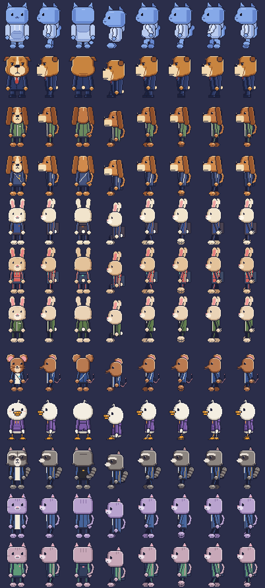

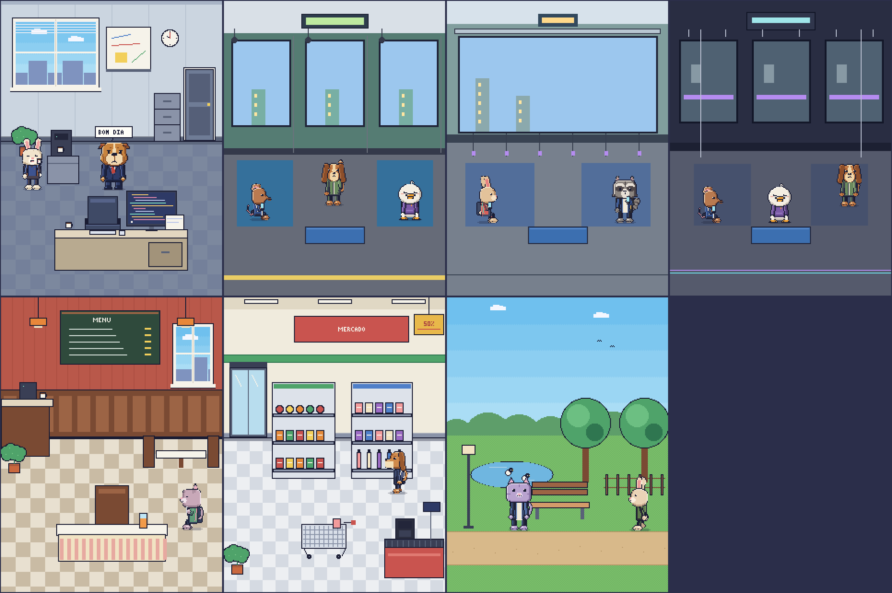

### Caminhada por espécie

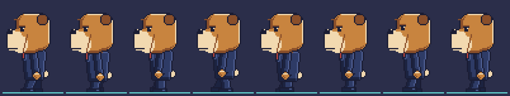

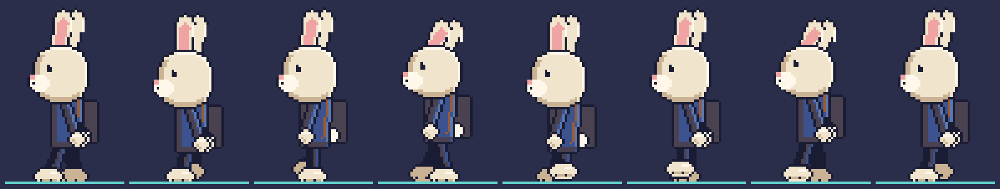

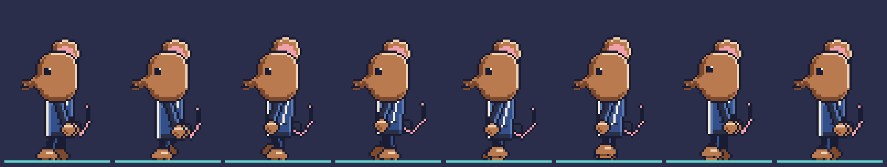

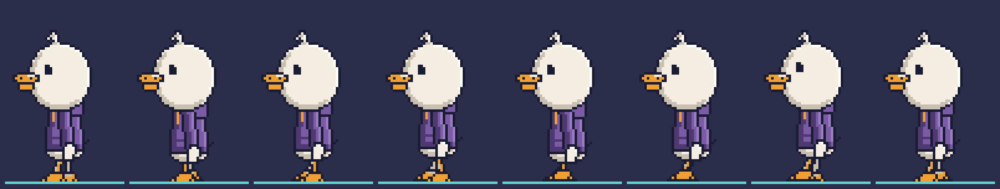

### Comparativos principais

Bulldog IDLE, WALK e TALK, e um render IDLE para cada uma das demais espécies, estão disponíveis nesta pasta: [Bulldog IDLE](npc-art-review/v3/bulldog_idle.png), [Bulldog WALK](npc-art-review/v3/bulldog_walk.png), [Bulldog TALK](npc-art-review/v3/bulldog_talk.png), [Dog](npc-art-review/v3/dog_idle.png), [Rabbit](npc-art-review/v3/rabbit_idle.png), [Mouse](npc-art-review/v3/mouse_idle.png), [Duck](npc-art-review/v3/duck_idle.png), [Raccoon](npc-art-review/v3/raccoon_idle.png) e [Cat](npc-art-review/v3/cat_idle.png). Os renders individuais das cenas também estão separados por arquivo. A aprovação manual anterior de Rafael cobre somente os grupos walk, idle, sleep e work então revisados; ela não se estende às matrizes e folhas novas descritas abaixo.

Estes arquivos documentam o resultado V3; os goldens automatizados oficiais continuam sendo os manifests em `app/src/test/resources`, verificados pela suíte de regressão visual.

## Gate de qualidade visual NPC V3

O renderer semântico compartilhado pelo Pixel Lab e pelos testes gera candidatos reproduzíveis com seed fixo. Execute:

```powershell
.\gradlew.bat :app:testDebugUnitTest --tests "com.hoodie.app.pixel.review.NpcVisualReviewExportTest" -PnpcVisualReview=true
```

Os candidatos versionados em [`npc-art-review/v3/index.html`](npc-art-review/v3/index.html) contêm sete matrizes principais com Hoodie ao lado, folhas WALK limpas e de depuração, TURN/SIT/TALK, expressões, recortes de cabeça 8×, roupas, props, e a matriz SCALE LEGIBILITY de 75% / 80% / 85% / 90% / 95% / 100%. As imagens de escala mostram o valor solicitado sem aplicar o piso ambiental; o relatório por espécie registra separadamente `productionScale`, o piso que a política usaria em produção. As folhas individuais ficam em [`npc-scale-v3`](npc-art-review/v3/npc-scale-v3/). O pacote também inclui métricas de retenção de pixels, cenas públicas em vários momentos de comportamento, versões noturnas aplicáveis, BOOK no trem e PRODUCT no mercado, relatório de regras e índice HTML. [`performance-report.json`](npc-art-review/v3/performance-report.json) registra os tempos por frame no Office, Bus, Metro e Journey sem aplicar limiar automático.

O relatório separa regras HARD (canvas/clipping, âncoras, cores não autorizadas, contato da passada e conexão de props) de avisos SOFT (contorno, silhueta, tamanho e contraste de pelo/roupa). `paletteSize` informa quantas cores da paleta da espécie aparecem no frame, `declaredPaletteSize` registra a paleta da identidade (limite de 10), e `renderedPaletteSize` inclui também cores de face e props compartilhadas. A aprovação anterior continua registrada com escopo explícito; o `review-manifest.json` deste conjunto permanece `PENDING` até Rafael aprovar estas evidências completas.

O SHA técnico não é aprovação artística. A gravação dos goldens V3 por `-PapproveNpcV3Goldens=true` exige aprovação humana e todos os gates do manifesto em `APPROVED`. A suíte nunca atualiza hashes automaticamente após uma mudança visual.
