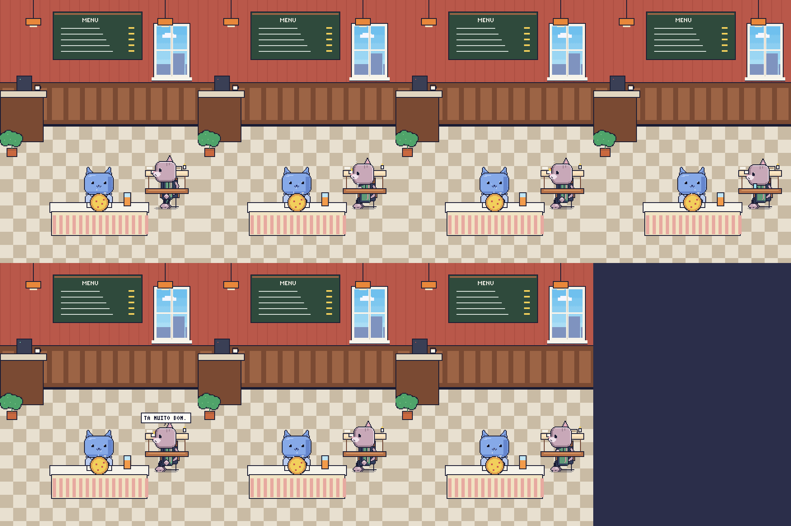
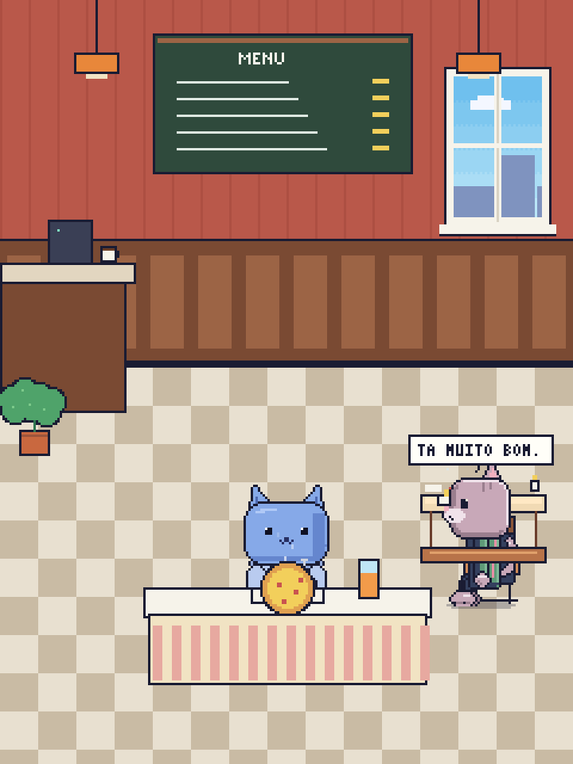
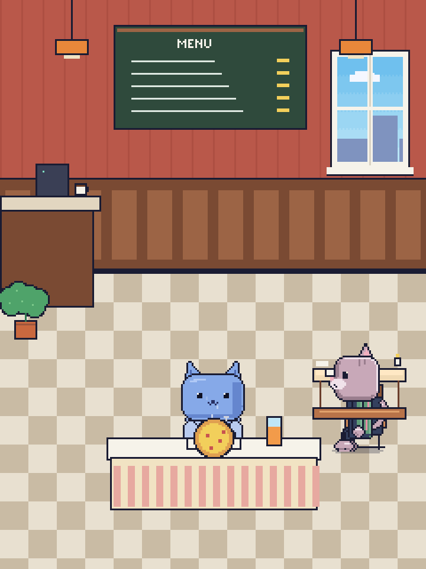
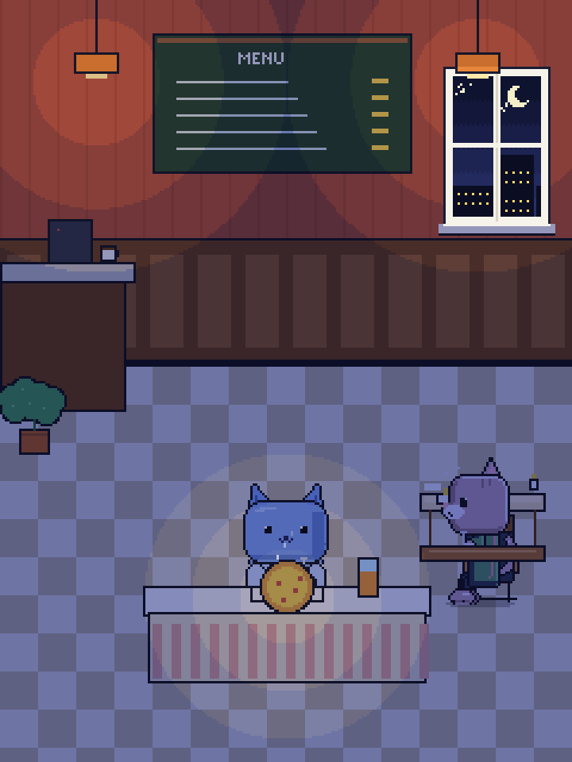

# Revisão da cena viva do restaurante

Estas capturas são candidatas geradas pelo teste de exportação da cena completa. Ainda não são goldens oficiais. Revisar composição, cadeira e oclusão do gato, mesa/prato/copo, balões de fala e legibilidade de dia/noite. O manifesto só deve sair de `PENDING_HUMAN_REVIEW` após aprovação visual humana.

## Contact sheet dos estados sentados

## Estados da refeição

| Estado | Captura |
|---|---|
| Sentado |  |
| Comendo |  |
| Bebendo |  |
| Celular |  |
| Falando |  |
| Olhando |  |
| Lendo o menu |  |
| Refeição concluída |  |
| Cena noturna |  |

Manifesto e hashes de render: [review-manifest.json](review-manifest.json).
